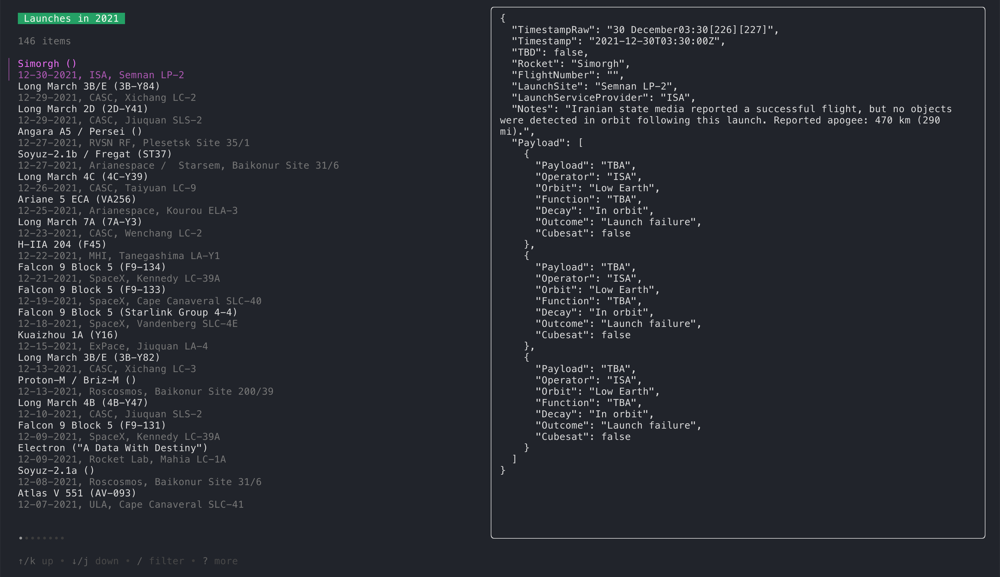

# Launchdata 🚀

[](https://github.com/vsinha/launchdata/actions/workflows/go.yml)



Wikipedia has a lot of interesting [data](https://en.wikipedia.org/wiki/List_of_spaceflight_launches_in_January%E2%80%93June_2022) about rocket launches, but it's hard to
parse and read the wikipedia table format. This library converts the wikipedia
launch tables to JSON for easy consumption.

`data/` contains the cleaned JSON data, organized by decade

## Usage

```sh
# Build
go build .

# Create a local cache
launchdata cache all --output-dir ./data

# Explore
launchdata browse 2022
```

## Similar datasources

- [planet4589](https://planet4589.org/space/gcat/data/derived/launchlog.html), maintained by [Jonathan McDowell](https://twitter.com/planet4589)
